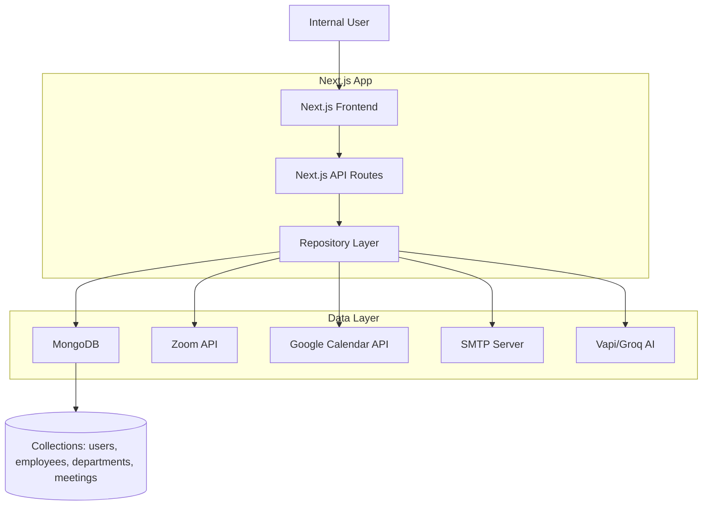
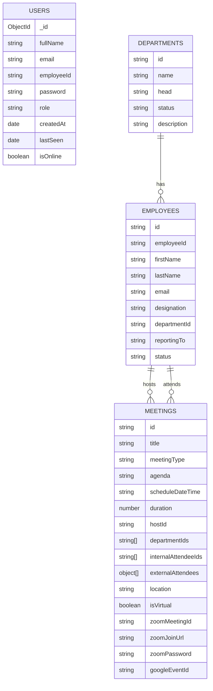
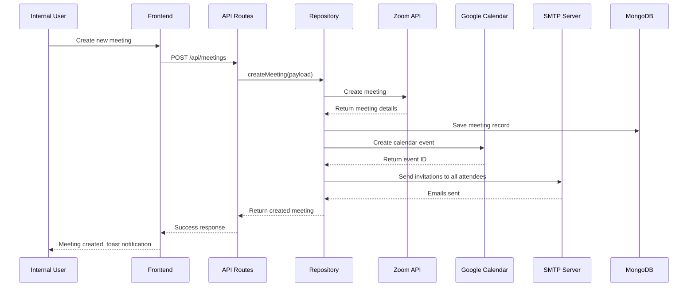

# Zoom Meeting Management

## Table of Contents
1. [Project Title & Description](#project-title--description)
2. [Ownership & Maintainers](#ownership--maintainers)
3. [Features](#features)
4. [Tech Stack](#tech-stack)
5. [Architecture Diagram](#architecture-diagram)
6. [Folder Structure](#folder-structure)
7. [Database Schema](#database-schema)
8. [API Endpoints](#api-endpoints)
9. [Environment & Access Requirements](#environment--access-requirements)
10. [Setup & Installation](#setup--installation)
11. [Usage](#usage)
12. [Workflow/Process Diagram](#workflowprocess-diagram)
13. [Deployment](#deployment)
14. [Known Issues / Limitations](#known-issues--limitations)
15. [Maintenance Notes / Roadmap](#maintenance-notes--roadmap)
16. [Internal Handover Notes](#internal-handover-notes)

---

## Project Title & Description

### Tagline
Enterprise Zoom Meeting Management Platform with Google Calendar & SMTP Integration

### Overview
This internal tool is designed to streamline the management of Zoom meetings, employees, and departments within IAC. It provides a centralized dashboard to create, update, and cancel meetings with automatic Zoom integration, Google Calendar syncing, and email notifications to all attendees. The system manages employee records, department assignments, and user authentication with role-based access.

Key problems solved:
- Manual scheduling of Zoom meetings and sending invites
- Lack of centralized meeting records and attendee tracking
- Fragmented communication between scheduling platforms

---

## Ownership & Maintainers
- **Built & Owned By**: IAC Team
- **Contact**: Maintainers listed in internal team directory
- **Last Updated**: July 2026

---

## Features
- **Meeting Management**: Create, view, update, and delete Zoom meetings
- **Zoom Integration**: Automatic Zoom meeting creation, updates, and deletion
- **Google Calendar Sync**: Two-way sync to add meetings to calendars, send invites, and track responses
- **Email Notifications**: Custom HTML/plain text invites, updates, and cancellations via SMTP
- **Employee Management**: Add, update, delete, and import employees via Excel
- **Department Management**: Manage departments and assign employees
- **User Authentication**: Secure JWT-based auth with password reset
- **Role-Based Access**: Users & admin roles
- **Dashboard**: Overview of today's meetings, active employees, and departments
- **Meeting Status**: Track upcoming, ongoing, and completed meetings
- **External Attendees**: Support for external guests beyond internal employees
- **AI Chatbot**: Vapi/Groq-powered chat integration for assistance

---

## Tech Stack
| Layer | Technology | Versions |
|-------|------------|----------|
| Frontend | Next.js (App Router), React 19, Tailwind CSS 4 | Next: 16.2.7 |
| Backend | Next.js API Routes, Node.js | |
| Database | MongoDB | |
| Authentication | JWT (jose), bcryptjs | |
| Integrations | Zoom API, Google Calendar API, Nodemailer (SMTP), Vapi, Groq, Mistral | |
| UI Libraries | Sonner (toasts), Lucide React (icons) | |
| Build Tools | React Compiler, ESLint | |

---

## Architecture Diagram


---

## Folder Structure
```
zoom-meeting-management/
├── src/
│   ├── app/
│   │   ├── (auth)/          # Auth pages (login, signup, reset password)
│   │   ├── api/             # Backend API routes
│   │   │   ├── auth/        # Authentication endpoints
│   │   │   ├── availability/
│   │   │   ├── calendar-events/
│   │   │   ├── chat/
│   │   │   ├── dashboard/
│   │   │   ├── departments/
│   │   │   ├── employees/
│   │   │   ├── meetings/
│   │   │   ├── users/
│   │   │   └── vapi/
│   │   ├── dashboard/       # Dashboard page
│   │   ├── departments/     # Departments management page
│   │   ├── employees/       # Employees management page
│   │   ├── meetings/        # Meetings management & details pages
│   │   ├── settings/        # Settings page
│   │   ├── layout.js        # Root layout
│   │   ├── page.js          # Home (redirects to dashboard)
│   │   └── globals.css      # Global styles
│   ├── components/
│   │   ├── layout/          # Layout components (ClientLayout, Sidebar)
│   │   └── ui/              # UI components (DateTimePicker, Chatbot, etc.)
│   └── lib/                 # Utility & integration modules
│       ├── AuthContext.jsx  # Authentication context provider
│       ├── formatters.js    # Date/time formatting utilities
│       ├── googleCalendar.js # Google Calendar API integration
│       ├── jwt.js           # JWT token utilities
│       ├── mailer.js        # SMTP email sending utilities
│       ├── mongodb.js       # MongoDB connection
│       ├── repository.js    # Core business logic & data access layer
│       ├── roles.js         # Role definitions
│       ├── useDepartments.js
│       └── zoom.js          # Zoom API integration
├── public/                  # Static assets
├── .gitignore
├── package.json
├── package-lock.json
├── next.config.mjs
├── eslint.config.mjs
├── postcss.config.mjs
└── jsconfig.json
```

---

## Database Schema



### Collections Details:
- **users**: System users with authentication details
- **employees**: Employee records linked to departments
- **departments**: Department definitions
- **meetings**: Meeting records with Zoom and Google Calendar references

---

## API Endpoints

| Method | Endpoint | Description | Auth Required | Internal/External |
|--------|----------|-------------|---------------|-------------------|
| POST | /api/auth/login | User login | No | Internal |
| POST | /api/auth/signup | User registration | No | Internal |
| GET | /api/auth/me | Get current user | Yes | Internal |
| POST | /api/auth/logout | User logout | Yes | Internal |
| POST | /api/auth/reset-password | Request password reset | No | Internal |
| PUT | /api/auth/reset-password | Confirm password reset | No | Internal |
| POST | /api/auth/change-password | Change password | Yes | Internal |
| PUT | /api/auth/update-profile | Update profile | Yes | Internal |
| POST | /api/auth/presence | Update user presence | Yes | Internal |
| GET | /api/dashboard | Get dashboard data | Yes | Internal |
| GET | /api/employees | List employees | Yes | Internal |
| POST | /api/employees | Create employee | Yes | Internal |
| DELETE | /api/employees | Bulk delete employees | Yes | Internal |
| GET | /api/employees/import | Import employees (Excel) | Yes | Internal |
| GET | /api/employees/[id] | Get employee by ID | Yes | Internal |
| PUT | /api/employees/[id] | Update employee | Yes | Internal |
| DELETE | /api/employees/[id] | Delete employee | Yes | Internal |
| GET | /api/departments | List departments | Yes | Internal |
| POST | /api/departments | Create department | Yes | Internal |
| GET | /api/departments/[id] | Get department by ID | Yes | Internal |
| PUT | /api/departments/[id] | Update department | Yes | Internal |
| DELETE | /api/departments/[id] | Delete department | Yes | Internal |
| GET | /api/meetings | List meetings | Yes | Internal |
| POST | /api/meetings | Create meeting | Yes | Internal |
| GET | /api/meetings/[id] | Get meeting by ID | Yes | Internal |
| PUT | /api/meetings/[id] | Update meeting | Yes | Internal |
| DELETE | /api/meetings/[id] | Delete meeting | Yes | Internal |
| GET | /api/users | List users | Yes | Internal |
| POST | /api/users | Create user | Yes | Internal |
| GET | /api/users/[id] | Get user by ID | Yes | Internal |
| PUT | /api/users/[id] | Update user | Yes | Internal |
| DELETE | /api/users/[id] | Delete user | Yes | Internal |
| GET | /api/calendar-events | List Google Calendar events | Yes | Internal |
| POST | /api/chat | AI chat endpoint | Yes | Internal |
| POST | /api/vapi | Vapi integration endpoint | Yes | Internal |
| POST | /api/availability | Check availability | Yes | Internal |

---

## Environment & Access Requirements

### Required Environment Variables (create .env.local)
```
MONGODB_URI=
MONGODB_DB=zoom_meeting_management
JWT_SECRET=
JWT_EXPIRY=7d
ZOOM_CLIENT_ID=
ZOOM_CLIENT_SECRET=
ZOOM_ACCOUNT_ID=
ZOOM_HOST_EMPLOYEE_ID=
GOOGLE_CLIENT_ID=
GOOGLE_CLIENT_SECRET=
GOOGLE_REFRESH_TOKEN=
GOOGLE_CALENDAR_ID=
SMTP_HOST=
SMTP_PORT=
SMTP_USER=
SMTP_PASSWORD=
VAPI_API_KEY=
GROQ_API_KEY=
MISTRAL_API_KEY=
```

### Credentials & Access
- **MongoDB**: Request access from internal infrastructure team
- **Zoom API**: Create Server-to-Server OAuth app in Zoom Marketplace, request credentials from Zoom admin
- **Google Calendar API**: Create OAuth 2.0 credentials, request refresh token via OAuth Playground
- **SMTP**: Use Gmail App Password or internal SMTP credentials
- **Vapi/Groq/Mistral**: Request API keys from internal AI/ML team

---

## Setup & Installation

### Prerequisites
- Node.js 20+
- npm or yarn
- MongoDB instance (local or Atlas)

### Step-by-Step Local Setup

1. **Clone repository**
   ```bash
   git clone <repo-url>
   cd zoom-meeting-management
   ```

2. **Install dependencies**
   ```bash
   npm install
   ```

3. **Configure environment variables**
   Copy `.env.example` (if exists) to `.env.local` and fill in all required variables.

4. **Run development server**
   ```bash
   npm run dev
   ```
   The app will be available at http://localhost:3000

---

## Usage

### Common Commands
- **Start development server**: `npm run dev`
- **Build production bundle**: `npm run build`
- **Start production server**: `npm start`
- **Lint code**: `npm run lint`

### Internal User Workflow
1. Log in using email/password
2. Navigate to Dashboard for overview of today's meetings
3. Go to Meetings page to create, edit, or delete meetings
4. Go to Employees/Departments pages to manage organization structure
5. Create a new meeting:
   - Enter title, type, agenda
   - Select date/time in Asia/Kolkata timezone
   - Choose host, internal attendees, and external guests
   - Mark as virtual/physical, enter location if needed
6. The system automatically:
   - Creates Zoom meeting
   - Adds to Google Calendar and invites all attendees
   - Sends custom email invitations

---

## Workflow/Process Diagram



---

## Deployment

### Deployment Process
- **Platform**: Vercel/Internal Infrastructure
- **CI/CD**: Push to main branch triggers auto-deployment
- **Environment Variables**: Configure in Vercel/hosting dashboard

### Redeployment/Restart
- For Vercel: Push a new commit or use Vercel dashboard to redeploy
- For internal server: Rebuild and restart with `npm run build && npm start`

---

## Known Issues / Limitations
- Timezone is hardcoded to Asia/Kolkata
- Some error handling is best-effort (e.g., Zoom/Calendar failures don't block meeting creation)
- External attendee responses are tracked only via Google Calendar
- No mobile-optimized UI (desktop-only)

---

## Maintenance Notes / Roadmap

### Technical Debt
- Improve error handling and add retries for external API calls
- Add comprehensive unit and integration tests
- Optimize database queries with indexes
- Add audit logging for critical actions

### Planned Improvements
- Add meeting templates
- Add recurrence for meetings
- Add custom email templates
- Improve reporting and analytics
- Add more robust availability checking

---

## Internal Handover Notes

### Critical Files
- [repository.js](src/lib/repository.js): Core business logic
- [zoom.js](src/lib/zoom.js): Zoom integration
- [googleCalendar.js](src/lib/googleCalendar.js): Google Calendar integration
- [mailer.js](src/lib/mailer.js): Email notifications
- [jwt.js](src/lib/jwt.js): Authentication tokens

### Key Quirks
- All datetimes are treated as Asia/Kolkata (IST) timezone
- Frontend sends raw local datetimes to avoid double-conversion
- Zoom uses Server-to-Server OAuth, no user-specific tokens
- Google Calendar is source of truth for attendee responses
- Meeting status (upcoming/ongoing/completed) is computed dynamically

### Manual Processes
- To get Google refresh token: Use OAuth 2.0 Playground with Calendar API scope
- Zoom host employee: Set via `ZOOM_HOST_EMPLOYEE_ID` env var
- Secrets management: Use internal secrets manager (not hardcoded)

### Where to Get Help
- Zoom API issues: Contact Zoom admin
- Google Calendar issues: Contact G Suite admin
- MongoDB access: Contact infrastructure team
- SMTP issues: Contact IT team

